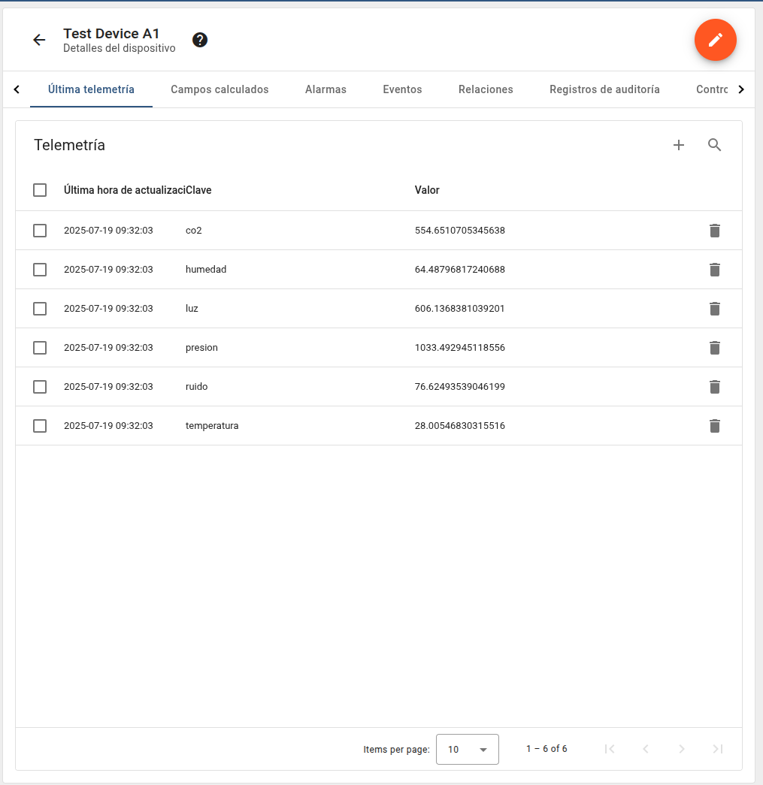

# 🧪 Módulo `simulador_cpp` – UrbIA

Este módulo forma parte del proyecto **UrbIA** y tiene como objetivo simular el comportamiento de múltiples sensores ambientales y enviar su telemetría a ThingsBoard mediante peticiones HTTP en formato JSON.

## 📦 Estructura del proyecto

```

simulador\_cpp/
├── include/             # Archivos de encabezado (.hpp)
├── src/                 # Implementación de clases (.cpp)
├── build/               # Archivos objeto compilados (.o)
├── sensor\_simulator     # Binario resultante tras compilación
├── .env                 # Archivo con token de autenticación
├── Makefile             # Archivo para construir el ejecutable
└── README.md            # Documentación del módulo

````

## 🌡️ Sensores simulados

El simulador genera lecturas de los siguientes sensores:

- `co2` (ppm)
- `temperatura` (°C)
- `humedad` (%)
- `presion` (hPa)
- `luz` (lux)
- `ruido` (dB)

Cada sensor tiene un rango de valores realistas y puede generar valores fuera de rango para simular fallos o eventos anómalos.

## 🔐 Configuración del token

El archivo `.env` debe contener el token de autenticación del dispositivo ThingsBoard:

```env
THINGSBOARD_TOKEN=tu_token_aqui
````

> Este token se obtiene desde ThingsBoard al crear un nuevo dispositivo.

## ⚙️ Compilación

Para compilar el simulador, asegúrate de tener instalado `g++` y `libcurl`. Luego, ejecuta:

```bash
make clean
make
```

Esto generará el ejecutable `sensor_simulator`.

## 🚀 Ejecución

Para ejecutar el simulador y enviar lecturas periódicas al servidor ThingsBoard:

```bash
./sensor_simulator
```

El simulador leerá el token desde el archivo `.env` y enviará los datos al endpoint:

```
https://inti-data.ngrok.io/telemetry/{TOKEN}
```

## 📡 Ejemplo de salida

```bash
📡 Sensor: co2, Valor: 450.34
📡 Sensor: temperatura, Valor: 32.27
📡 Sensor: humedad, Valor: 72.57
📡 Sensor: presion, Valor: 993.66
📡 Sensor: luz, Valor: 202.45
📡 Sensor: ruido, Valor: 64.40
✅ Datos enviados correctamente. Código de respuesta: 200
```

Los valores fuera de rango son detectados y marcados con un ❌.

## ✅ Integración con ThingsBoard

Una vez enviados los datos, pueden visualizarse desde la pestaña **Última telemetría** del dispositivo en ThingsBoard:



> Puedes personalizar paneles o reglas en ThingsBoard a partir de estos datos.

## 🛠️ Dependencias

* C++17
* libcurl
* Make

## 🧠 Créditos

Desarrollado como parte del proyecto doctoral **UrbIA** para simulación de IoT urbano inteligente con integración SDN y Edge Computing.
